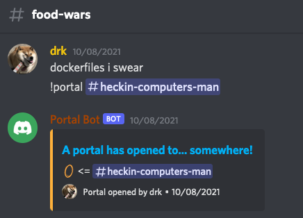
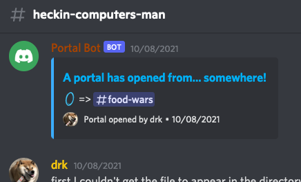

# discord-portals
> A Typescript library to create two-way links between channels -- portals! 

Open a portal to take the conversation to a channel where it'll be more appreciated.



Click  click the **"A portal has opened to... somewhere!"** link. and you're in the other channel



To return to the original channel, click the **"A portal has opened from... somewhere!"** link.
## Pre-requisite
* Node.js v16+
* discord.js v13.0.0+

## Usage
```typescript
// Derive the portal details from the message being responded to. Expects the message to contain a text channel reference.
let portal = portals.createPortal(msg, client)

if (portal != null) {
  // "Opens" the portal between two channels by creating Discord cards in each channel that link to each other.
  let opener = new portals.CardPortalOpener(client)
  await opener.open(portal)
}
```